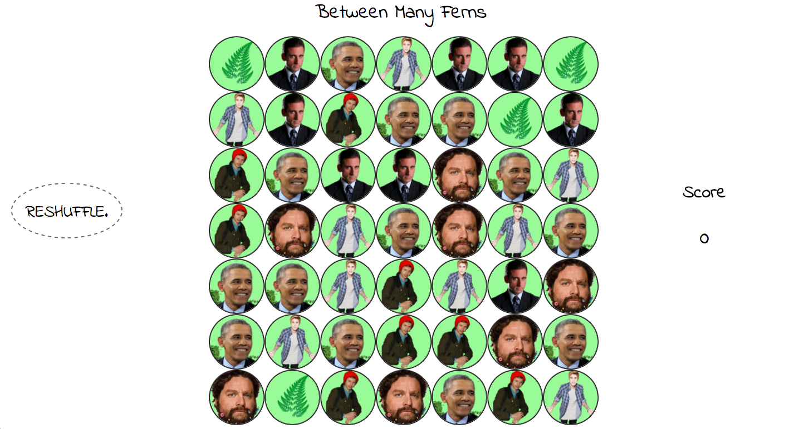

# Between Many Ferns - a twist on Bejeweled

## WDI London - Project 1 - Game 

*A modern twist on a timeless classic.*

##### [Play it here!](https://secure-dawn-20517.herokuapp.com/)

##Rules

1 Player Game:

1. Choose 2 tiles to switch to match chains of similar tiles.
2. Tiles may only switch to adjacent tiles and only in horizontal or vertical directions.
3. Chains of 3 or more gain you points.
4. Your chained reactions may cause further matches resulting in bigger scores. 
5. Try and beat your last score!

##Approach

The board is created dynamically and immediately any chains of similar tiles with lengths of three or more are cleared. The tiles cascade down from above by grabbing the class of the tile above if it is not empty. This iterates through the whole board and then randomly generates replacements for the empty tiles. This process continues until there are no more available of 3 or more.

The game is now ready to be played. Event listeners over the board look out for the first and second clicks to indicate the two tiles that the player wishes to move. These locations are captured and their classes switched. The game then checks for any chains this switch may have caused. If new chains have been made available, all tiles in any chains across all the rows and columns have their classes changed to empty. The process from the beginning of the game occurs again until the board is ready for the player to choose 2 more tiles to switch. These subsequent chains that have been caused by the player also contribute to their score. 

##Build

* jQuery, CSS & HTML5 were used to make the game.

##Problems & Challenges

The main issue I had was ensuring scaleability. I used various indices and patterns of iterations to ensure that the chains of matched tiles continued up to the edge of the board. This means that the game is dependent on the width of the board (n) alone. That is to say, if n is changed, the whole game logic continues to function correctly, no matter how large it becomes.
